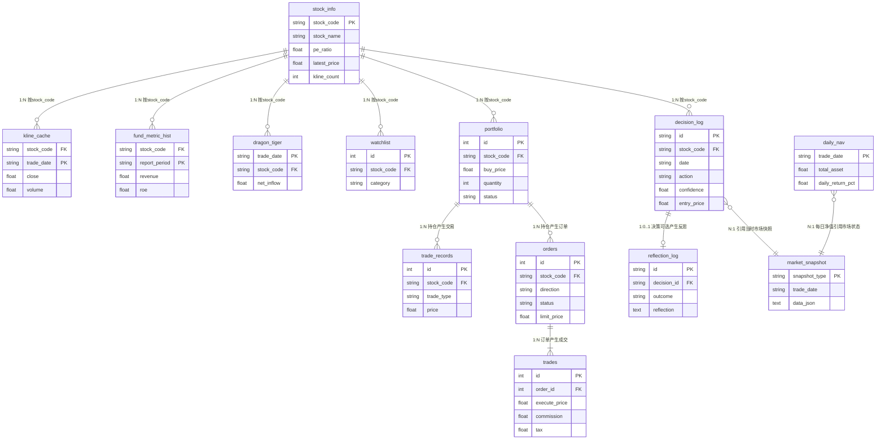

# S5 — 数据层设计

> **核心原则**: 数据库优先，API为辅。SQLite是主数据库，不是缓存。
> 历史数据永久存储，新数据自动回填，查询优先走数据库。
> 参考 Qlib(Microsoft) 的数据管理理念 + vnpy 的数据库架构 + AlphaAnalyst 的数据获取器设计。

## 5.1 数据流架构（Database-First模式）

```
用户请求（如：查询600519最近3年日K线）
  │
  ├─→ Step 1: 数据库查询
  │     → [数据完整且最新] → 直接返回（零API调用）
  │     → [数据缺失或过旧] → Step 2
  │
  ├─→ Step 2: 增量更新
  │     → 计算缺失的时间范围
  │     → 从API获取缺失数据
  │     → 写入数据库（增量，不覆盖已有数据）
  │     → 返回完整数据
  │
  ├─→ Step 3: API失败降级
  │     → [有旧数据] → 返回旧数据（标记"截至日期"）
  │     → [无任何数据] → 返回空+错误信息
  │
  └─→ Step 4: 定时全量更新（每日收盘后）
        → 自动更新所有活跃股票的日K线
        → 自动更新财务数据（季报/年报发布时）
```

### 与旧设计的区别

| 维度 | 旧设计（缓存模式） | 新设计（数据库模式） |
|------|-------------------|---------------------|
| 数据生命周期 | 过期就丢 | 永久保留 |
| 历史数据 | 不存 | 存5年+ |
| 数据完整性 | 不检查 | 自动补全缺失 |
| 更新策略 | 被动（查询时更新） | 主动（定时更新）+ 被动 |
| 查询能力 | 简单 | SQL复杂查询 |

## 5.2 数据存储策略

### 永久存储（数据库）

| 数据类型 | 存储表 | 更新频率 | 保留策略 |
|----------|--------|----------|----------|
| 日K线 | `kline_daily` | 每日收盘后 | 永久 |
| 周K线 | `kline_weekly` | 每周五 | 永久 |
| 月K线 | `kline_monthly` | 每月末 | 永久 |
| 财务报表 | `fund_metric_hist` | 季报/年报发布时 | 永久 |
| 股票基本信息 | `stock_info` | 每日更新 | 永久 |
| 指数数据 | `index_daily` | 每日收盘后 | 永久 |

### 临时缓存（内存/短期）

| 数据类型 | 缓存方式 | TTL | 说明 |
|----------|----------|-----|------|
| 实时行情 | 内存缓存 | 5分钟 | 盘中高频更新 |
| 北向资金 | 内存缓存 | 5分钟 | 盘中实时 |
| 板块排行 | 内存缓存 | 10分钟 | 盘中更新 |
| 新闻公告 | SQLite | 24小时 | 每日更新 |
| 龙虎榜 | SQLite | 24小时 | 每日更新 |

## 5.3 数据更新机制

### 增量更新（查询时触发）

```python
class DatabaseFirstDataBus:
    """数据库优先的数据总线"""

    async def get_kline(self, code: str, days: int = 365) -> pd.DataFrame:
        """获取日K线数据，数据库优先"""
        # Step 1: 查询数据库
        db_data = await self.db.query_kline(code, days)

        if db_data is not None and self._is_fresh(db_data):
            return db_data  # 数据完整且最新，直接返回

        # Step 2: 计算缺失范围
        last_date = db_data["trade_date"].max() if db_data is not None else None
        today = datetime.now().strftime("%Y-%m-%d")

        if last_date and last_date >= today:
            return db_data  # 数据已到最新

        # Step 3: 增量获取缺失数据
        start_date = last_date or (datetime.now() - timedelta(days=days)).strftime("%Y-%m-%d")
        new_data = await self._fetch_from_api(code, start_date, today)

        if new_data is not None and len(new_data) > 0:
            # Step 4: 写入数据库（增量，不覆盖）
            await self.db.insert_kline(code, new_data)
            # 合并返回
            if db_data is not None:
                return pd.concat([db_data, new_data]).drop_duplicates("trade_date")
            return new_data

        # Step 5: API失败，返回旧数据
        if db_data is not None:
            return db_data  # 返回旧数据
        raise DataUnavailableError(f"无法获取 {code} 的K线数据")
```

### 定时全量更新（每日收盘后）

```python
class DailyDataUpdater:
    """每日数据更新器"""

    async def run_daily_update(self):
        """每日收盘后执行"""
        # 1. 更新所有活跃股票的日K线
        active_stocks = await self.db.get_active_stocks()
        for stock in active_stocks:
            await self._update_kline(stock.code)

        # 2. 更新指数数据
        await self._update_indices()

        # 3. 更新北向资金
        await self._update_north_flow()

        # 4. 检查财务数据更新
        await self._check_financial_updates()

        # 5. 数据完整性检查
        await self._verify_data_integrity()

    async def _update_kline(self, code: str):
        """增量更新单只股票K线"""
        last_date = await self.db.get_last_kline_date(code)
        today = datetime.now().strftime("%Y-%m-%d")

        if last_date and last_date >= today:
            return  # 已是最新

        start_date = last_date or "2020-01-01"  # 首次获取从2020年开始
        data = await self._fetch_from_api(code, start_date, today)

        if data is not None:
            await self.db.insert_kline(code, data)
```

### 数据完整性检查

```python
class DataIntegrityChecker:
    """数据完整性检查"""

    async def check_kline_completeness(self, code: str) -> dict:
        """检查K线数据完整性"""
        # 获取交易日历
        trading_days = await self._get_trading_days(code)

        # 获取已存储的数据
        stored_dates = await self.db.get_kline_dates(code)

        # 检查缺失
        missing = trading_days - stored_dates

        return {
            "code": code,
            "total_trading_days": len(trading_days),
            "stored_days": len(stored_dates),
            "missing_days": len(missing),
            "completeness_pct": len(stored_dates) / len(trading_days) * 100,
            "missing_dates": sorted(missing)[-10:],  # 最近10个缺失日期
        }
```

## 5.4 断路器（CircuitBreaker）— 完整状态机

**源文件**: `providers/source_base.py:69-189`

```
CLOSED ──连续3次失败──→ OPEN ──冷却300秒──→ HALF_OPEN ──成功2次──→ CLOSED
                                                                  └──失败──→ OPEN
```

每个数据源适配器（SourceAdapter）内置一个断路器实例：
- **CLOSED**: 正常工作，允许请求
- **OPEN**: 熔断开启，拒绝所有请求，等待冷却
- **HALF_OPEN**: 试探恢复，只放1个探针请求

参数：
- `failure_threshold=3`: 连续3次失败触发熔断
- `cooldown_seconds=300`: 熔断冷却5分钟
- `half_open_max_calls=1`: HALF_OPEN只放1个探针
- `success_threshold=2`: 连续2次成功恢复CLOSED

## 5.5 重试与退避（retry_with_backoff）

**源文件**: `providers/source_base.py:350-396`

错误分类（`classify_error`）：

| 异常类型 | 分类 | 重试策略 |
|----------|------|----------|
| httpx.TimeoutException | TransientError | 指数退避 1.5s→3s，重试2次 |
| httpx.ConnectError | TransientError | 指数退避 1.5s→3s，重试2次 |
| HTTP 429 | RateLimitError | 更长退避 1.5s→6s→24s |
| HTTP 502/503/504 | TransientError | 指数退避，重试2次 |
| HTTP 401/403/404 | PermanentError | 立即抛出，不重试 |
| 其他异常 | TransientError | 指数退避，重试2次 |

所有重试带jitter（±10%随机偏移），防止雷击效应。

## 5.6 HTTP连接池与并发控制

**HTTP连接池**（`source_base.py:196-313`）：
- httpx.Client连接池：最多20个连接，10个keep-alive
- User-Agent轮换：5个UA随机切换，防反爬
- 连接复用：keep-alive减少TCP握手开销
- 命名池单例：每个数据源独立连接池

**API频率限制器**（`source_base.py:479-530`）：
- 信号量控制：最多5个并发API请求
- 僵尸线程回收：120秒无响应自动释放信号量
- 上下文管理器：`with rate_limiter: do_fetch()`

**国内网络优化**（`market_data.py:38-39`）：
- 强制IPv4：国内金融API拒绝IPv6
- NO_PROXY环境变量：避免代理干扰国内请求
- 已知不可用源快速跳过：`_KNOWN_DEAD_SOURCES = {"tickflow", "baostock", "eastmoney", "efinance", "hot_rank", "board_rank"}`

## 5.7 数据源适配器

**基类**: `SourceAdapter`（`source_base.py:403-472`）

```python
class SourceAdapter:
    name: str = ""           # 唯一标识符
    priority: int = 99       # 优先级（越小越优先）
    timeout: float = 10.0    # 默认超时

    # 每个适配器实现这些方法：
    def fetch_kline(self, code, days): ...    # 日K线
    def fetch_basic(self, code): ...          # 基本面
    def fetch_indices(self): ...              # 指数
    def fetch_north_flow(self): ...           # 北向资金
    def fetch_stock_spot(self): ...           # 全市场快照
    def test_connect(self): ...               # 健康检查
```

**已实现的适配器**（直接复用）：

| 适配器 | 文件 | 用途 | 优先级 |
|--------|------|------|--------|
| TencentAdapter | `providers/sources/tencent.py` | 实时行情、K线、基本面 | 1（主） |
| SinaAdapter | `providers/sources/sina.py` | 行情、财务数据 | 2 |
| SinaFinancialAdapter | `providers/sources/sina_financial.py` | 四大报表详细数据 | 2 |
| EastMoneyAdapter | `providers/sources/eastmoney.py` | 板块、资金流 | 3 |
| AKShareAdapter | `providers/sources/akshare_src.py` | 综合数据（龙虎榜/北向/公告） | 4 |
| BaoStockAdapter | `providers/sources/baostock_src.py` | 历史K线（回测用） | 5 |
| LhbAdapter | `providers/sources/lhb.py` | 龙虎榜 | 4 |
| HotRankAdapter | `providers/sources/hot_rank.py` | 热门股票 | 4 |
| BoardRankAdapter | `providers/sources/board_rank.py` | 板块排行 | 4 |
| ZtPoolAdapter | `providers/sources/zt_pool.py` | 涨停池 | 4 |

## 5.8 SQLite数据库模型

**源文件**: `shared/models.py`（713行，v5.6迁移版本）

### 核心数据表

**stock_info** — 股票基础信息+行情+技术面（最核心，50+列）
```
stock_code (UNIQUE) | stock_name | category | industry
基本面: pe_ratio | pb_ratio | gross_margin | net_margin | roe | net_profit | total_market_cap | float_market_cap
行情快照: latest_price | change_pct | turnover_rate | volume | amount
技术指标: ma5 | ma10 | ma20 | ma60 | ma250 | rsi_14 | macd | atr_14 | volatility_20d | max_drawdown_60d
趋势信号: trend | ma_alignment
衍生指标: change_pct_5d | change_pct_20d | change_pct_60d | volume_ratio
财务指标: eps | bvps | debt_to_equity | net_income | current_assets | total_liabilities | free_cash_flow
估值: dividend_yield | shares_outstanding | cash_to_assets | insider_holding_pct
元数据: kline_count | last_kline_date | listing_days | notes | created_at | updated_at
```

**kline_cache** — 历史K线缓存
```
stock_code + trade_date (复合索引)
open | high | low | close | volume | amount | change_pct | turnover_rate
```

**market_snapshot** — 市场快照（JSON存储）
```
snapshot_type (UNIQUE) | trade_date | data_json (TEXT) | updated_at
用于: indices | north_flow | sectors | stock_quote
```

**fund_metric_hist** — 财务指标时序（季报/年报）
```
stock_code + report_period (复合索引)
利润表: revenue | net_income | gross_profit | operating_income | eps
资产负债表: total_assets | total_liabilities | shareholders_equity | current_assets | current_liabilities | cash_and_equivalents | total_debt | inventory | accounts_receivable
现金流量表: ocf_net | capex | fcf
比率: roe | roa | debt_to_equity | current_ratio | gross_margin | net_margin
增长: revenue_yoy | net_income_yoy
其他: bvps | dividend_per_share | institution_holding_pct | north_flow_hold
```

**dragon_tiger** — 龙虎榜数据
```
trade_date + stock_code (复合索引)
limit_up_count | limit_type
buy_dep1-3 | buy_amount1-3 | total_buy | total_sell | net_inflow
```

### 交易与组合表

| 表名 | 用途 | 关键字段 |
|------|------|----------|
| `portfolio` | 持仓 | stock_code, buy_price, quantity, current_price, status(HOLDING/SOLD), portfolio_type |
| `trade_records` | 交易记录 | stock_code, trade_type(BUY/SELL), price, quantity, amount |
| `orders` | 模拟交易订单 | direction, quantity, price_type, limit_price, status, signal_confidence |
| `trades` | 成交记录 | order_id, execute_price, commission, tax, slippage_cost |
| `daily_nav` | 每日净值 | total_asset, cash, stock_value, daily_return_pct, cumulative_return_pct |
| `daily_reports` | 每日报告 | market_summary, recommendations, risk_level |

### 其他表

| 表名 | 用途 |
|------|------|
| `watchlist` | 自选股（stock_code, category, add_reason） |
| `analysis_tasks` | 分析任务队列（task_id, status, progress, result_json） |
| `style_signal` | 风格信号评分（stock_code + style, score, signal, rank） |
| `screen_result` | 选股运行记录（run_id, style, stage1-3_passed, recommendations_json） |
| `system_logs` | 系统日志（module, level, message） |
| `_migration_version` | 迁移版本追踪（当前v5.6） |

## 5.9 数据库初始化与迁移

**源文件**: `shared/models.py:544-610`

```python
def init_db(db_path="data/investment.db"):
    engine = get_engine(db_path, reuse=True)  # 复用引擎避免锁
    Base.metadata.create_all(engine)           # 创建所有表
    
    with engine.connect() as conn:
        _ensure_migration_version(conn)        # 迁移版本追踪
        _safe_add_column(conn, ...)            # 增量加列（不破坏旧数据）
```

**关键设计**：
- `StaticPool` + `check_same_thread=False`: SQLite线程安全
- 引擎缓存: `_ENGINE_CACHE` 防止多引擎冲突
- 增量迁移: `_safe_add_column` 先检查列是否存在再加列
- 版本追踪: `_migration_version` 表记录当前版本

### 迁移策略详解

```python
def get_current_version(conn) -> int:
    result = conn.execute("SELECT MAX(version) FROM _migration_version").fetchone()
    return result[0] if result[0] else 0

def apply_migration(conn, version: int, description: str, sql: str):
    """应用迁移（幂等：已应用的跳过）"""
    current = get_current_version(conn)
    if version <= current:
        return False
    conn.execute(sql)
    conn.execute(
        "INSERT INTO _migration_version (version, description) VALUES (?, ?)",
        (version, description)
    )
    conn.commit()
    return True
```

### 迁移文件组织

```
migrations/
├── v001_create_kline.sql        # 创建K线表
├── v002_add_indicators.sql      # 添加技术指标列
├── v003_create_reports.sql      # 创建报告表
├── v004_create_decisions.sql    # 创建决策日志表
└── ...
```

命名规则: `v{版本号}_{描述}.sql`，版本号递增。

## 5.10 新系统数据库表规划

基于现有系统精简，新系统需要的表：

| 表名 | 来源 | 说明 |
|------|------|------|
| `stock_info` | 复用 | 50+列，直接复用 |
| `kline_cache` | 复用 | K线缓存，直接复用 |
| `market_snapshot` | 复用 | 市场快照JSON，直接复用 |
| `fund_metric_hist` | 复用 | 财务时序，直接复用 |
| `dragon_tiger` | 复用 | 龙虎榜，直接复用 |
| `portfolio` | 复用 | 持仓管理，直接复用 |
| `trade_records` | 复用 | 交易记录，直接复用 |
| `orders` | 复用 | 模拟交易，直接复用 |
| `trades` | 复用 | 成交记录，直接复用 |
| `daily_nav` | 复用 | 每日净值，直接复用 |
| `watchlist` | 复用 | 自选股，直接复用 |
| `decision_log` | **新增** | Agent决策日志（见S9） |
| `reflection_log` | **新增** | 反思记录（见S9） |

**可删除的表**（新系统不需要）：
- `daily_reports` — 改用文件系统存储报告
- `analysis_tasks` — LangGraph检查点替代
- `style_signal` — 选股逻辑简化
- `screen_result` — 选股逻辑简化
- `system_logs` — 用Python logging替代

### 5.10.1 ER 关系图（新系统 13 张表）



**关系说明**：
- `stock_info` 是枢纽表，其余 8 张业务表通过 `stock_code` 关联（逻辑外键，SQLite 不强制物理外键以保证写入性能）。
- 交易链路：`portfolio`(持仓) → `orders`(下单) → `trades`(成交)，订单与成交是 1:N。
- 决策与记忆链路：`decision_log`(每次分析) → 可选 `reflection_log`(事后反思)，1:0..1。
- `market_snapshot` 是宽表（JSON 存储），被 `daily_nav` 和 `decision_log` 引用以记录"决策时的市场环境"。
- `_migration_version` 为系统表，独立于业务关系，故未画出。

## 5.11 免费数据源清单（仅免费）

| 数据类型 | 主要来源 | 备用来源 | 适配器文件 | 频率 |
|----------|----------|----------|-----------|------|
| 实时行情 | 腾讯行情API | 新浪行情 | `tencent.py` / `sina.py` | 日频+ |
| 历史K线 | BaoStock | yfinance/AKShare | `baostock_src.py` / `yfinance_src.py` / `akshare_src.py` | 日频 |
| 财务数据 | 新浪财务 | AKShare | `sina_financial.py` / `akshare_src.py` | 季报/年报 |
| 技术指标 | 本地计算(stockstats) | 纯pandas备用 | `tools/technical_indicators.py` | 日频 |
| 新闻公告 | AKShare(巨潮资讯) | 东方财富 | `akshare_src.py` / `eastmoney.py` | 日频 |
| 龙虎榜 | AKShare | 东方财富 | `lhb.py` / `akshare_src.py` | 日频 |
| 北向资金 | AKShare | 东方财富 | `akshare_src.py` / `eastmoney.py` | 日频 |
| 融资融券 | AKShare | 东方财富 | `akshare_src.py` | 日频 |
| 板块概念 | AKShare | 东方财富 | `akshare_src.py` / `board_rank.py` | 日频 |
| 资金流向 | 东方财富 | 新浪 | `eastmoney.py` | 日频 |
| 大股东增减持 | AKShare | 东方财富 | `akshare_src.py` | 季报 |
| 涨停池 | AKShare | 东方财富 | `zt_pool.py` | 日频 |
| 热门股票 | AKShare | 东方财富 | `hot_rank.py` | 日频 |
| 美股/港股参考 | yfinance | — | `yfinance_src.py` | 日频 |

## 5.12 数据质量控制

**源文件**: `providers/data_quality.py`

检查维度：
- **缺失率**: `data.isnull().sum() / len(data)`
- **异常值**: IQR检测（四分位距法）
- **新鲜度**: 数据时间戳 vs 当前时间
- **跨源一致性**: 同一股票不同源的价格偏差检查

## 5.13 股票代码标准化

不同数据源使用不同格式，需要统一转换层：

| 数据源 | 格式 | 示例 |
|--------|------|------|
| 数据库(内部) | 纯数字 | `600519` |
| BaoStock | 前缀+数字 | `sh.600519` |
| yfinance | 数字+后缀 | `600519.SS` |
| AKShare | 纯数字 | `600519` |
| 腾讯/新浪 | 纯数字 | `600519` |

```python
class StockCodeNormalizer:
    """股票代码标准化"""

    @staticmethod
    def to_db(code: str) -> str:
        """统一转为数据库格式: 600519"""
        code = code.strip()
        for prefix in ["sh.", "sz.", "bj."]:
            if code.startswith(prefix):
                return code[3:]
        if "." in code:
            return code.split(".")[0]
        return code

    @staticmethod
    def to_baostock(code: str) -> str:
        """转为BaoStock格式: sh.600519"""
        code = StockCodeNormalizer.to_db(code)
        if code.startswith("6"):
            return f"sh.{code}"
        elif code.startswith(("0", "3")):
            return f"sz.{code}"
        elif code.startswith(("4", "8")):
            return f"bj.{code}"
        return f"sh.{code}"

    @staticmethod
    def to_yfinance(code: str) -> str:
        """转为yfinance格式: 600519.SS"""
        code = StockCodeNormalizer.to_db(code)
        if code.startswith("6"):
            return f"{code}.SS"
        elif code.startswith(("0", "3")):
            return f"{code}.SZ"
        return f"{code}.SS"

    @staticmethod
    def get_exchange(code: str) -> str:
        """获取交易所: SH/SZ/BJ"""
        code = StockCodeNormalizer.to_db(code)
        if code.startswith("6"):
            return "SH"
        elif code.startswith(("0", "3")):
            return "SZ"
        elif code.startswith(("4", "8")):
            return "BJ"
        return "SH"
```

## 5.14 复用清单

| 模块 | 源文件路径 | 行数 | 复用方式 |
|------|-----------|------|----------|
| 断路器 | `providers/source_base.py:69-189` | 120行 | 直接复制 |
| 重试+退避 | `providers/source_base.py:350-396` | 47行 | 直接复制 |
| HTTP连接池 | `providers/source_base.py:196-313` | 117行 | 直接复制 |
| 频率限制器 | `providers/source_base.py:479-530` | 52行 | 直接复制 |
| 错误分类 | `providers/source_base.py:320-347` | 27行 | 直接复制 |
| 数据总线 | `services/data_bus.py` | 543行 | 适配后复用 |
| SQLite模型 | `shared/models.py` | 713行 | 精简后复用 |
| 腾讯适配器 | `providers/sources/tencent.py` | — | 直接复制 |
| 新浪适配器 | `providers/sources/sina.py` | — | 直接复制 |
| AKShare适配器 | `providers/sources/akshare_src.py` | — | 直接复制 |
| BaoStock适配器 | `providers/sources/baostock_src.py` | — | 直接复制 |
| 东方财富适配器 | `providers/sources/eastmoney.py` | — | 直接复制 |
| 数据质量 | `providers/data_quality.py` | — | 直接复制 |
| **总计** | | **~2500行** | **直接迁移，无需重写** |

---

**依赖**: S3(架构), S2(理念)
**被依赖**: S6(工作流), S8(风险), S9(记忆)
